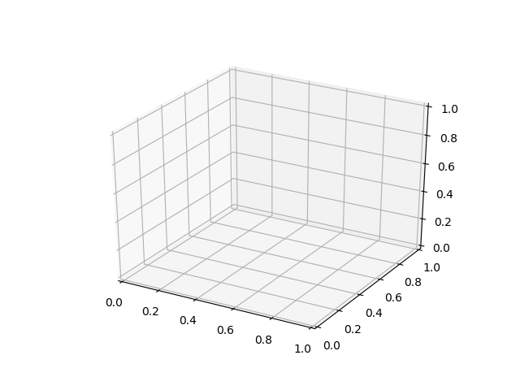

# Starting out in the galaxy

Before starting to be concerned with planets, the essential components of a solar system model must be demonstrated.
This tutorial will specify how to draw a sphere in a 3d environment.

## 3d in python

Programming languages do not know about spheres or cuboids, circles or squares, or even what a drawing is.
They need to be told how to create an image on the screen according to the specifications given.
This is a [really complicated topic](https://en.wikipedia.org/wiki/Computer_graphics) and some people spend their whole careers in pursuit of better ways to do it.
Needless to say, most programmers do not need to be concerned with the details.
They just need to find a [package or library](https://realpython.com/python-modules-packages/) which will do the job for them.
In the same way that most people can drive a car by knowing about the steering wheel, accelerator, brake, indicators and so on, but not necessarily understanding internal combustion, programmers use packages and libraries to perform complex operations without having to do everything themselves.

Here are some python packages which can be used for 3d graphics:
- [matplotlib](https://matplotlib.org/mpl_toolkits/mplot3d/tutorial.html)
- [VPython](https://vpython.org/)
- [PyOpenGL](http://pyopengl.sourceforge.net/)

In this tutorial, matplotlib will be used.
If you have ever seen a complex graph on a website or as part of research of any kind, it may well have been created with matplotlib.
It is great for all sorts of bar charts, line plots, histograms etc.
It also has tools for creating 3d plots, which will be used to make our solar system.

## Creating a sphere

If you are not familiar with 3d graphs, imagine a normal line chart where you can also move forwards and backwards.
A 2d plot has x and y axes, which all points can be specified to.
A 3d plot has x, y **and z** dimensions.
We will create a sphere at the centre of this 3d space, with coordinates of (0, 0, 0).
This point, where all the axes meet, is known as the origin.

Enough talk, let's code!

*Note: Remember to activate your virtual environment so that you can access the matplotlib package.*

Firstly, get the packages we need:
```python
import matplotlib.pyplot as plt
from mpl_toolkits.mplot3d.axes3d import Axes3D
```
*Find out more about import [here](https://www.codementor.io/sheena/python-path-virtualenv-import-for-beginners-du107r3o1).*

This allows us to use the special tools from **matplotlib**. For example, we can now create our 3d space:
```python
# Create a figure
fig = plt.figure()
# Add a 3d subplot
ax = fig.add_subplot(projection="3d")
```
Running this code produces no notable output. That's because **matplotlib** is designed to let you set up your graphics before you show them.
To see the 3d space, add:
```python
plt.show()
```
to the bottom of your script and run it.

You should now be looking at something like this:


This is nice, but let's add the sphere!
There are a couple of different ways to do this.
They are designed to be used in particular situations, so it is best to take a look at them before making a decision.
The following code should be put in between the lines where you created the figure and 3d subplot, and where you show the plot.
```python
import matplotlib.pyplot as plt
from mpl_toolkits.mplot3d.axes3d import Axes3D

fig = plt.figure()
ax = fig.add_subplot(projection="3d")

###################
# New code
###################

plt.show()
```

*Note: # is a special symbol in python which means anything after it and on the same line is not code that should be run*

### Scatter plot

A scatter plot is typically good for having lots of points all over the place.
The points can be marked with particular colours, shapes and sizes.
Make a sphere with scatter plots by adding it to your 3d space:
```python
# Make a scatter plot at 0 on all the axes
ax.scatter(0, 0, 0)
```